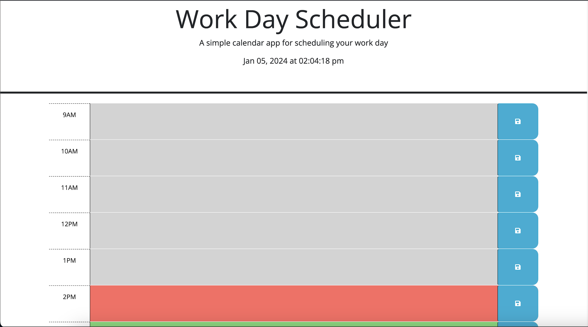
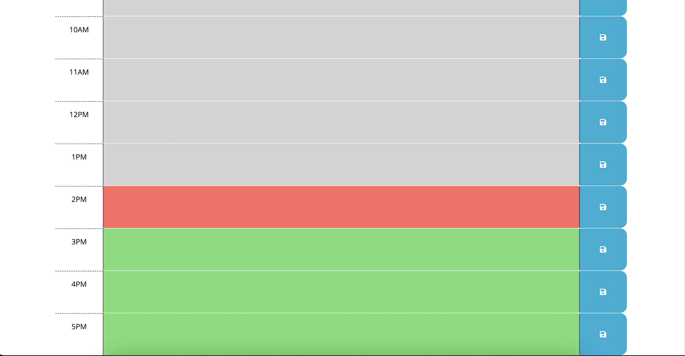
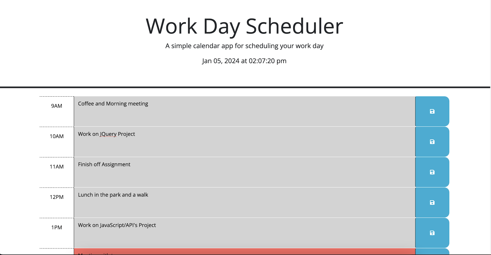
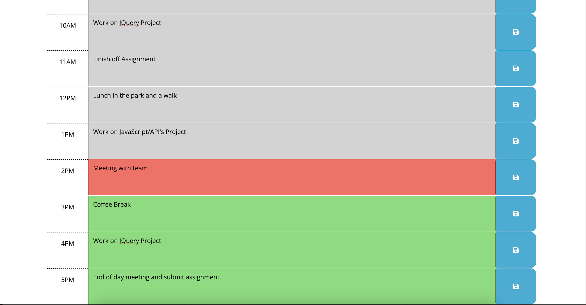

# Work-Day-Schedule

A live schedule of your daily appointments or tasks.

## Description

This application is a Weekday Schedule Planner. In real-time it lets the user enter and save important appointments, daily To-Do's and deadlines. It keeps track of all past, present and future inputs and displays them in a very user friendly way. Utilising localStorage methods so that even after the user ends the session in the browser the entries appear when you next load the application.

Whilst building this application I have learnt just how versitle and powerful both the 'JQuery' and 'Bootstrap' libraries can be, the importance of the correct use of localStorage as well as the utility of dayjs() methods. I have enjoyed working on this project as it has allowed me to utilize my skills and further my programming knowledge.

## Installation 

To use this application you need to open the following link in your browser - 

https://eddiedpayne.github.io/Weekday-Planner-Project/

 ## Usage 

 With the click of the 'save button' you can add any appointment, deadline or To-do items to this weekday schedule. See clearly wether your entry is either past, is happening now or yet to come with the user friendly color-theme. Grey for past, Red for present and Green for future entries.

 

  

   

## License

(MIT) -- Please see the license associated with this Repository

## Features 

This Weekday Schedule Planner offers the ability to its users to save entries between the hours of 9:00am and 5:00pm.

It's clean and intuitive UI allows users to efficiently organise their daily tasks and events for the day.

This application provides a convienent overview of the day allowing the user to effectively plan and manage their time.
